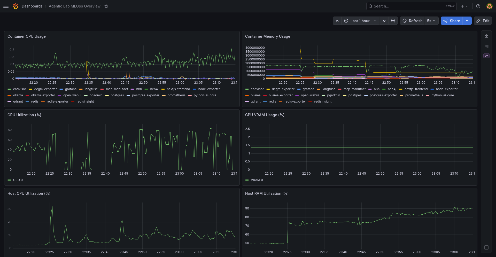
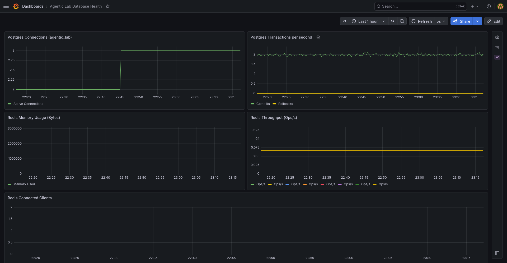

# Laboratorio de Investigación y Desarrollo de Agentes de IA


---


## Introduccion

Plataforma local para investigación, integración y operación de sistemas de IA
agentica sobre una arquitectura self-hosted. El proyecto reúne frontend, backend,
modelos locales, bases de datos, automatización y observabilidad en un entorno
Docker Compose diseñado para experimentar con Agentic Ops, flujos multiagente,
RAG, herramientas MCP y monitoreo MLOps sin depender de infraestructura externa.

El objetivo de esta versión es ofrecer una base ejecutable y extensible: varios
servicios ya están provisionados y comunicados por redes Docker, mientras que
algunas capacidades avanzadas se encuentran preparadas como puntos de extensión
para las siguientes iteraciones.


---


## Visión Ejecutiva

Agentic Lab V3 está pensado como un laboratorio de soberanía tecnológica para
equipos que necesitan probar, observar y evolucionar aplicaciones de IA con
control local sobre datos, modelos y servicios de soporte.

La plataforma permite:

- Ejecutar un portal web Next.js como punto de entrada para experiencias A2UI.
- Exponer un backend FastAPI con un grafo LangGraph mínimo funcional.
- Operar modelos locales mediante Ollama y Open WebUI.
- Provisionar almacenamiento relacional, cache, base vectorial y de grafos.
- Automatizar flujos con n8n.
- Observar infraestructura, contenedores, bases de datos y cache con Prometheus y Grafana.
- Preparar integraciones MCP para herramientas externas o dominios especializados.


---


## Estado Actual Del Proyecto

Esta versión levanta 18 servicios Docker y entrega una base integrada para
desarrollo local. La documentación distingue entre capacidades implementadas y
capacidades preparadas para evolución.

| Área | Estado | Detalle |
| :--- | :--- | :--- |
| Infraestructura Docker | Implementada | Compose define redes, volúmenes y 18 servicios operativos. |
| Backend AI Core | Implementado mínimo | FastAPI expone `/health`, `/docs` y `POST /api/v1/agent`. |
| LangGraph | Implementado mínimo | Existe un grafo con un nodo mock `adk_mcp_node`. |
| Frontend Next.js | Base creada | La app corre en Next.js con CopilotKit instalado, pero conserva UI base. |
| CopilotKit | Preparado | `RootLayout` envuelve la app con `CopilotKit`; falta runtime/API route real. |
| MCP Manufact | Placeholder | El contenedor existe y queda vivo, pero aún no ejecuta un servidor MCP funcional. |
| Qdrant | Provisionado | Base vectorial disponible; falta integración RAG desde la lógica de aplicación. |
| PostgreSQL | Provisionado | Base relacional lista para metadatos, usuarios, trazas o memoria persistente. |
| Redis | Provisionado | Cache/estado disponible con password; falta integración explícita en el backend. |
| Neo4j | Provisionado | Base de datos de grafos para memoria estructurada y razonamiento complejo. |
| Observabilidad | Parcialmente implementada | Prometheus scrapea host, contenedores, Postgres y Redis; DCGM está desplegado pero comentado en Prometheus. |


---


## Arquitectura Del Sistema

La solución está organizada en cuatro redes lógicas que separan responsabilidades
y reducen acoplamiento entre capas.

| Red | Servicios principales | Responsabilidad |
| :--- | :--- | :--- |
| `frontend-net` | `nextjs-frontend`, `open-webui` | Interfaces de usuario y acceso interactivo. |
| `backend-net` | `python-ai-core`, `postgres`, `redis`, `qdrant`, `n8n`, `mcp-manufact`, `neo4j` | Orquestación, persistencia, automatización y herramientas. |
| `ai-net` | `ollama`, `open-webui`, `qdrant`, `python-ai-core`, `mcp-manufact`, `neo4j` | Inferencia local, contexto vectorial y conectores de IA. |
| `observability-net` | `prometheus`, `grafana`, exporters | Métricas, dashboards y visibilidad operativa. |


### Flujo conceptual

1. El usuario accede al portal Next.js o a Open WebUI.
2. El frontend puede invocar el backend `python-ai-core`.
3. El backend ejecuta un grafo LangGraph y queda preparado para consultar memoria,
   herramientas MCP, modelos locales y almacenamiento.
4. Ollama sirve modelos locales y Open WebUI ofrece una interfaz directa para
   interactuar con ellos.
5. Qdrant, Postgres, Redis y Neo4j entregan las capas de contexto vectorial,
   persistencia relacional, cache y memoria de relaciones.
6. Prometheus recolecta métricas y Grafana las presenta en dashboards MLOps.


---


## Mapa De Servicios Y Endpoints


### Interfaces de usuario

| Servicio         | URL local                         | Uso                                        |
| :--------------- | :-------------------------------- | :----------------------------------------- |
| Main Web Portal  | <http://localhost:3000>           | Aplicación Next.js principal.              |
| Open WebUI       | <http://localhost:8080>           | Chat local para interactuar con Ollama.    |
| n8n Automation   | <http://localhost:5678>           | Automatización visual de workflows.        |
| Grafana          | <http://localhost:3001>           | Dashboards de observabilidad y MLOps.      |
| Langfuse         | <http://localhost:3031>           | Observabilidad y trazas de LLMs.           |
| PgAdmin 4        | <http://localhost:5050>           | Administración visual de PostgreSQL.       |
| RedisInsight     | <http://localhost:8001>           | Exploración y administración de Redis.     |
| Qdrant Dashboard | <http://localhost:6333/dashboard> | Administración de colecciones vectoriales. |
| Neo4j Browser    | <http://localhost:7474>           | Exploración visual de grafos de conocimiento. |


### APIs y servicios técnicos

| Servicio        | Endpoint                                            | Uso                                         |
| :-------------- | :-------------------------------------------------- | :------------------------------------------ |
| AI Core API     | <http://localhost:8000>                             | Backend FastAPI de orquestación.            |
| AI Core Swagger | <http://localhost:8000/docs>                        | Documentación OpenAPI generada por FastAPI. |
| Health Check    | `GET http://localhost:8000/health`                  | Verifica disponibilidad del backend.        |
| Agent Endpoint  | `POST http://localhost:8000/api/v1/agent?query=...` | Ejecuta el grafo LangGraph mínimo.          |
| Ollama API      | <http://localhost:11434>                            | API local para modelos LLM.                 |
| Qdrant API      | <http://localhost:6333>                             | API HTTP de la base vectorial.              |
| Prometheus      | <http://localhost:9090>                             | Consulta de métricas y targets.             |
| PostgreSQL      | `localhost:5432`                                    | Base relacional expuesta al host local.     |
| Redis           | `localhost:6379`                                    | Cache expuesta al host local con password.  |
| Neo4j (Bolt)    | `localhost:7687`                                    | Protocolo binario para grafos.               |


---


## Catálogo De Contenedores

| Contenedor | Imagen / build | Rol |
| :--- | :--- | :--- |
| `nextjs-frontend` | `v2-nextjs-frontend` | Portal web en Next.js. |
| `python-ai-core` | `v2-python-ai-core` | API FastAPI y grafo LangGraph. |
| `open-webui` | `ghcr.io/open-webui/open-webui:main` | UI de chat para Ollama. |
| `ollama` | `ollama/ollama` | Runtime local de modelos. |
| `qdrant` | `qdrant/qdrant:latest` | Base de datos vectorial. |
| `postgres` | `postgres:15-alpine` | Persistencia relacional. |
| `redis` | `redis:alpine` | Cache y estado efímero. |
| `neo4j` | `neo4j:5.12-community` | Base de datos de grafos. |
| `n8n` | `docker.n8n.io/n8nio/n8n` | Automatización de workflows. |
| `mcp-manufact` | `node:20-alpine` | Placeholder para servidor MCP Manufact. |
| `grafana` | `grafana/grafana:latest` | Visualización de métricas. |
| `langfuse` | `langfuse/langfuse:2` | Observabilidad y trazas de LLMs. |
| `prometheus` | `prom/prometheus:latest` | Recolección y consulta de métricas. |
| `pgadmin` | `dpage/pgadmin4` | Administración de PostgreSQL. |
| `redisinsight` | `redislabs/redisinsight:latest` | Administración de Redis. |
| `node-exporter` | `prom/node-exporter:latest` | Métricas del host. |
| `cadvisor` | `gcr.io/cadvisor/cadvisor:latest` | Métricas de contenedores. |
| `dcgm-exporter` | `nvcr.io/nvidia/k8s/dcgm-exporter:3.3.0-3.2.0-ubuntu22.04` | Métricas NVIDIA GPU. |
| `postgres-exporter` | `prometheuscommunity/postgres-exporter` | Métricas de PostgreSQL. |
| `redis-exporter` | `oliver006/redis_exporter` | Métricas de Redis. |
| `ollama-exporter` | `ghcr.io/frcooper/ollama-exporter` | Métricas de Ollama. |


---


## Flujo Operativo Local


### Requisitos

- Linux recomendado: Ubuntu 24.04 LTS.
- Docker y Docker Compose.
- GPU NVIDIA compatible si se usará aceleración local con Ollama/DCGM.
- NVIDIA Container Toolkit para exponer GPU a contenedores.
- 16 GB RAM como base recomendada; 8 GB o más de VRAM para modelos 7B+.


### Primer arranque

```bash
cp .env.example .env
make build
make up
make update-models
```

`make update-models` descarga en Ollama:

- `gemma3:4b`
- `gemma2:2b` (Google)


### Script de operación

El script `agentic_ops.sh` automatiza instalación base, inicialización del `.env`
y control del laboratorio:

```bash
./agentic_ops.sh install
./agentic_ops.sh start
./agentic_ops.sh status
./agentic_ops.sh restart
./agentic_ops.sh stop
```

`install` puede instalar Docker y NVIDIA Container Toolkit en sistemas compatibles.
Revisa el script antes de ejecutarlo en estaciones compartidas o ambientes
corporativos.


---


## Comandos Makefile

| Comando | Descripción |
| :--- | :--- |
| `make help` | Lista comandos disponibles. |
| `make up` | Inicia todos los servicios en segundo plano. |
| `make down` | Detiene y remueve contenedores y redes. |
| `make build` | Reconstruye imágenes de backend y frontend. |
| `make restart` | Reinicia la infraestructura. |
| `make logs` | Muestra logs en tiempo real. |
| `make update-models` | Descarga modelos base en Ollama. |


---


## Backend AI Core

El servicio `python-ai-core` está construido con FastAPI y expone el núcleo de
orquestación inicial del laboratorio.

### Endpoints actuales

| Método | Ruta | Descripción |
| :--- | :--- | :--- |
| `GET` | `/health` | Devuelve estado básico del servicio. |
| `POST` | `/api/v1/agent?query=...` | Ejecuta el grafo LangGraph con la consulta enviada. |
| `GET` | `/docs` | Documentación Swagger/OpenAPI. |

### Estado del grafo

El archivo `backend/python-ai-core/agent_graph.py` define:

- `AgentState` con `input` y `output`.
- Un nodo `adk_mcp_node`.
- Un grafo LangGraph compilado con una sola transición hacia `END`.

El nodo responde actualmente con una salida mock:

```text
Mock A2A/A2UI Processed: <input> con MCP Manufact.
```

Esto valida el esqueleto de ejecución, pero todavía no representa un flujo
multiagente completo ni una integración real con MCP, RAG o memoria persistente.


---


## Frontend Next.js + CopilotKit

El servicio `nextjs-frontend` ejecuta una aplicación Next.js con React y Tailwind.
La app incluye dependencias de CopilotKit y el layout principal envuelve la
experiencia con `CopilotKit`.

Estado actual:

- Next.js corre en modo desarrollo dentro del contenedor.
- CopilotKit está instalado y montado en el layout.
- La pantalla principal aún conserva la UI base generada por Create Next App.
- Falta implementar el runtime/API route `/api/copilotkit` para una experiencia
  A2UI completa.

Esta capa es el punto natural para evolucionar hacia un portal operacional:
chat agentico, panel de tareas, estado de servicios, trazas, ejecución de
workflows y visualización de respuestas generativas.


---


## Datos, Memoria Y RAG

La plataforma provisiona tres componentes de datos principales.

| Componente | Uso previsto | Estado |
| :--- | :--- | :--- |
| PostgreSQL | Metadatos, usuarios, sesiones, auditoría, historial y memoria persistente. | Disponible. |
| Redis | Cache, colas ligeras, locks, estado temporal y coordinación asíncrona. | Disponible con password. |
| Qdrant | Embeddings, colecciones vectoriales y Retrieval-Augmented Generation. | Disponible. |
| Neo4j | Grafos de conocimiento, memoria episódica y razonamiento de relaciones. | Disponible. |

Actualmente estos servicios están listos a nivel infraestructura. La combinación
de Qdrant (semántica) con Neo4j (relaciones) permite implementar arquitecturas
**GraphRAG** de alto rendimiento. Las integraciones de aplicación deben añadirse
en el backend y en los flujos de automatización según el caso de uso.


---


## Observabilidad MLOps

El stack de observabilidad está compuesto por Prometheus, Grafana y exporters
especializados.

| Componente | Métricas |
| :--- | :--- |
| `node-exporter` | CPU, memoria, filesystem y host. |
| `cadvisor` | Contenedores Docker, consumo y salud. |
| `postgres-exporter` | PostgreSQL. |
| `redis-exporter` | Redis. |
| `dcgm-exporter` | GPU NVIDIA, si está disponible. |

Prometheus tiene configurados targets para Prometheus, Node Exporter, cAdvisor,
Postgres Exporter y Redis Exporter. El target de DCGM existe como intención
operativa, pero se encuentra comentado en `prometheus/prometheus.yml`; debe
activarse cuando el host exponga correctamente las métricas GPU.

Grafana se provisiona con dashboards y datasource de Prometheus desde los
directorios `grafana/provisioning` y `grafana/dashboards`.


---


<p align="center">
  
</p>


---


<p align="center">
  
</p>


---


## Credenciales De Desarrollo

Estas credenciales están definidas como valores de ejemplo para desarrollo local.
Deben cambiarse antes de usar el stack en redes compartidas, demos públicas o
entornos con datos sensibles.

| Servicio   | Usuario / email       | Password               |
| :--------- | :-------------------- | :--------------------- |
| Grafana    | `admin`               | `admin`                |
| PgAdmin 4  | `admin@agentic.com`   | `admin`                |
| PostgreSQL | `agentic_admin`       | `secret_postgres_pass` |
| Redis      | N/A                   | `secret_redis_pass`    |
| Neo4j      | `neo4j`               | `secret_neo4j_pass`    |
| Open WebUI | Configuración inicial | Configuración inicial  |
| n8n        | Configuración inicial | Configuración inicial  |
| Langfuse   | `admin` (si se crea)  | Configuración inicial  |

Variables relevantes:

- `POSTGRES_USER`
- `POSTGRES_PASSWORD`
- `POSTGRES_DB`
- `PGADMIN_DEFAULT_EMAIL`
- `PGADMIN_DEFAULT_PASSWORD`
- `REDIS_PASSWORD`
- `QDRANT_API_KEY`
- `OLLAMA_BASE_URL`
- `WEBUI_SECRET_KEY`
- `LANGFUSE_*`


---


## Seguridad Y Soberanía Operativa

El laboratorio prioriza ejecución local y control de datos. Por diseño, los
servicios se comunican dentro de redes Docker y los volúmenes persisten en el
host local.

Recomendaciones mínimas:

- Cambiar todas las credenciales de `.env` antes de compartir el entorno.
- No exponer puertos de administración a Internet sin proxy, TLS y autenticación.
- Revisar secretos de LangChain, OpenAI o Anthropic si se conectan proveedores externos.
- Separar credenciales de demo, desarrollo y producción.
- Restringir acceso a PostgreSQL, Redis, Grafana, PgAdmin y RedisInsight.
- Auditar volúmenes antes de respaldar o mover el laboratorio.

Aunque el stack está preparado para escenarios air-gapped, cualquier integración
con APIs externas, descarga de modelos o telemetría de terceros debe evaluarse
según las políticas de privacidad del entorno.


---


## Troubleshooting


### Ver estado de contenedores

```bash
docker compose ps
```


### Revisar logs

```bash
make logs
```

Para un servicio específico:

```bash
docker compose logs -f python-ai-core
docker compose logs -f nextjs-frontend
docker compose logs -f ollama
```


### Validar backend

```bash
curl http://localhost:8000/health
```

Respuesta esperada:

```json
{"status":"ok","service":"python-ai-core"}
```


### Probar endpoint agentico mínimo

```bash
curl -X POST "http://localhost:8000/api/v1/agent?query=hola"
```


### Verificar modelos en Ollama

```bash
docker exec -it ollama ollama list
```


### Warning conocido de Compose

Docker Compose puede mostrar un aviso indicando que el atributo `version` en
`docker-compose.yml` es obsoleto. El stack puede seguir funcionando; se recomienda
retirarlo en una limpieza futura para evitar confusión.


---


## Referencia Rápida

| Tarea | Comando / URL |
| :--- | :--- |
| Levantar stack | `make up` |
| Detener stack | `make down` |
| Reconstruir imágenes | `make build` |
| Reiniciar stack | `make restart` |
| Ver logs | `make logs` |
| Descargar modelos | `make update-models` |
| Portal principal | <http://localhost:3000> |
| Backend docs | <http://localhost:8000/docs> |
| Open WebUI | <http://localhost:8080> |
| Grafana | <http://localhost:3001> |
| Prometheus | <http://localhost:9090> |
| Neo4j Browser | <http://localhost:7474> |


---
